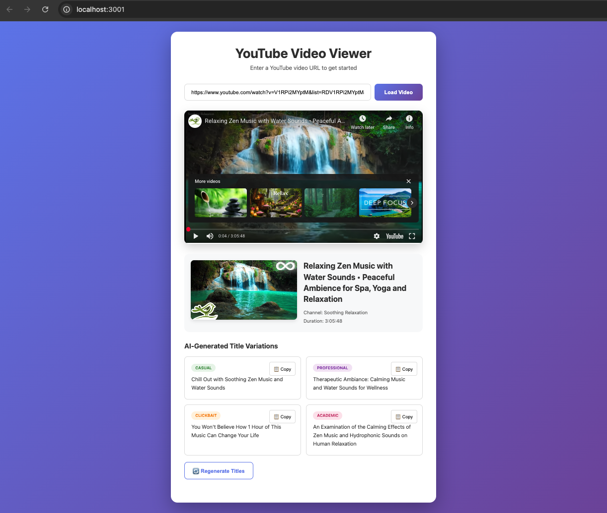

# YouTube Video Metadata & AI Title Generator

A modern web application that fetches YouTube video metadata and generates AI-powered title variations using different tones. Built with TypeScript and Vite.

## Features

- 🎥 **YouTube Video Metadata** - Fetch title, thumbnail, duration, and channel info
- 🤖 **AI Title Generation** - Generate 4 AI-powered title variations (Casual, Professional, Clickbait, Academic)
- 🎨 **Modern UI** - Clean, responsive design with smooth animations
- 🔒 **Privacy First** - API keys stored in .env file (never committed)
- ⚡ **Fast & Free** - Uses Groq's free API for AI generation
- 📋 **Copy to Clipboard** - Easy one-click copying of generated titles

## Demo



## Tech Stack

- **Frontend**: TypeScript, HTML5, CSS3
- **Build Tool**: Vite
- **APIs**:
  - YouTube Data API v3 (video metadata)
  - Groq API with Llama 3.3 70B (AI title generation)

## Getting Started

### Prerequisites

- Node.js 18+ and npm
- YouTube Data API key ([Get one here](https://console.cloud.google.com/))
- Groq API key ([Get one FREE here](https://console.groq.com/) - no credit card required)

📖 **Need help getting API keys?** See [SETUP.md](SETUP.md) for detailed step-by-step instructions.

### Installation

1. Clone the repository:
```bash
git clone https://github.com/yourusername/ytapp-project.git
cd ytapp-project
```

2. Install dependencies:
```bash
npm install
```

3. Create a `.env` file in the root directory:
```bash
cp .env.example .env
```

4. Open `.env` and add your API keys:
```env
VITE_YOUTUBE_API_KEY=your_youtube_api_key_here
VITE_GROQ_API_KEY=your_groq_api_key_here
```

5. Start the development server:
```bash
npm run dev
```

6. Open the URL shown in your terminal (usually http://localhost:5173) in your browser

### Usage

1. Paste any YouTube video URL in the input field
2. Click "Load Video" or press Enter
3. View the video player (autoplays) with metadata (thumbnail, title, channel, duration)
4. See 4 AI-generated title variations with different tones
5. Click "📋 Copy" to copy any title to clipboard
6. Click "🔄 Regenerate Titles" for new variations

## API Keys Setup

### YouTube Data API Key

1. Go to [Google Cloud Console](https://console.cloud.google.com/)
2. Create a new project (or select existing)
3. Enable "YouTube Data API v3"
4. Go to Credentials → Create Credentials → API Key
5. (Optional) Restrict the key to YouTube Data API v3

**Cost**: Free tier includes 10,000 quota units/day (1 video = 3 units)

### Groq API Key

1. Go to [Groq Console](https://console.groq.com/)
2. Sign up (free, no credit card required)
3. Navigate to API Keys section
4. Create a new API key

**Cost**: Completely FREE
- 30 requests/minute
- 14,400 requests/day
- No credit card required

## Build for Production

```bash
npm run build
```

The optimized production build will be in the `dist/` directory.

## Deployment

This is a static frontend app and can be deployed to:

- **GitHub Pages** (free)
- **Netlify** (free tier)
- **Vercel** (free tier)
- **Cloudflare Pages** (free tier)

No backend or server required!

## Project Structure

```
ytapp-project/
├── index.html              # Main HTML file
├── src/
│   ├── main.ts            # TypeScript application logic
│   └── style.css          # Styles
├── package.json           # Dependencies
├── tsconfig.json          # TypeScript configuration
├── vite.config.ts         # Vite configuration
└── README.md              # This file
```

## Security & Privacy

- ✅ API keys stored in `.env` file (never committed to git)
- ✅ No backend server = no server-side data storage
- ✅ Pure frontend application
- ✅ No tracking or analytics
- ⚠️ Never commit your `.env` file to git
- ⚠️ `.env` is already in `.gitignore` for your safety

## Contributing

Contributions are welcome! Please feel free to submit a Pull Request.

## License

[ISC](LICENSE)

## Acknowledgments

- [YouTube Data API](https://developers.google.com/youtube/v3)
- [Groq](https://groq.com/) for free AI API access
- [Vite](https://vitejs.dev/) for lightning-fast development

## Support

If you encounter any issues or have questions:
1. Check that your API keys are valid
2. Ensure the YouTube video is public (not private/unlisted)
3. Verify you haven't exceeded API rate limits
4. Open an issue on GitHub

---

Made with ❤️ by Alan Le
